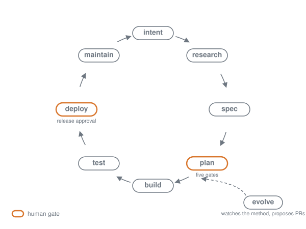

# Cycle Engineering

**Every framework stops at the PR. Cycle Engineering doesn't stop.**

*Em português: [README.pt-BR.md](README.pt-BR.md).*

Cycle Engineering is a Claude Code plugin that runs the whole build cycle inside your repository: intent, research, spec, plan, build, test, deploy, maintain, and back to intent. Each stage leaves one committed Markdown file and triggers the next. Deterministic hooks stand between the agent and the actions that are expensive to undo.

## What changes

In a repository with a `.cycle/` directory:

- Claude will not edit code without an accepted plan (`plans/<name>.md`, `status: accepted`, accepted by a named person). The plan needs an approved spec. The spec needs an accepted intent.
- Before build, a devil's advocate in a fresh context attacks the plan. When the change touches money, hours, permissions, schema, destructive data or a user-facing surface, a council reviews it too: five engineering seats always, a pool of marketing, content, UX, UI, CX, brand-voice, commercial, legal and data seats that sit when the plan lights their triggers, and a scenario seat that reads the plan across horizons without betting on one future. Then the Mule, a separate fresh-context agent, injects one improbable external shock and says what breaks.
- Before the session says "done", a verifier in a separate context runs what was built.
- A hook blocks production deploys unless a human wrote today's date into `.cycle/release-approval` (or set `RELEASE_APPROVAL`). The agent is blocked from writing that file.
- A hook blocks destructive commands (`git reset --hard`, `rm -rf` inside the repo, `drop table`, `migrate reset`) unless a snapshot note from the last hour exists in `.cycle/work/`.
- Every numbered task in the plan is its own commit. If you stop with an accepted plan and uncommitted changes, the session says so.

Opt out: delete `.cycle/` from the repository, in your own terminal. Without it, no gate runs. The agent is blocked from deleting it.

## Requirements

- Claude Code
- Node.js 18 or newer (the hooks are Node; there is no other dependency)

Without Node the gates are inactive, and the session start says so instead of failing silently.

Open Claude Code **inside the repository**. The hooks read `.cycle/` from the directory the session started in, not from the repository a command touches. A session started in a parent folder or a notes vault that edits and deploys this repository runs with no gate at all (`intent/2026-09-04-portoes-presos-ao-diretorio-da-sessao.md` tracks the fix).

## Install

```bash
claude plugin marketplace add guiloureiromkt/cycle-engineering
claude plugin install cycle@cycle-engineering
```

Then, inside a repository, run `/cycle:init`. It creates `.cycle/` (config, gate patterns, a work directory) and a marked block in `CLAUDE.md`. Nothing else is copied into your repo.

## The loop



## Eight stages

An accepted intent says what hurts. Nobody decides how to solve it before looking at how it has been solved: that is why research sits between intent and spec, and why the devil's advocate opens on the research's weakest assumption.

Each stage is a skill (`cycle:<stage>`). The table says what each one leaves in git and where a human signs.

| Stage | What it commits | Human gate |
|---|---|---|
| `cycle:intent` | `intent/<name>.md`: the problem, who has it, what done looks like; sub-intents; a sweep of what already exists inside and outside the repo. | A named person accepts it (`status: accepted`, `accepted_by`). |
| `cycle:research` | `research/<name>.md`: what we know (sourced, dated, typed by confidence), what the market does (three to five benchmarks, direct and indirect, used not read), what we assume, what we did not check, a recommendation for the spec. Depth by trigger: shallow for a bug, deep for a new product or money. | None. `status: done` is the precondition for the spec. The only skip is the router's shortcut, which also skips the spec. |
| `cycle:spec` | `specs/<name>.md`: requirements that can be checked one by one; design references and a wireframe when there is a screen. | A named person approves it (`status: approved`, `approved_by`). |
| `cycle:plan` | `plans/<name>.md`: numbered tasks, files, risks, and the record of five gates (task graph, devil's advocate, pre-mortem, council, loop). | Accepted after the gates (`status: accepted`). Nothing is coded before this. |
| `cycle:build` | One commit per numbered task; intermediates in `.cycle/work/<intent>/`. A change to the plan lands in the same commit as the code. | None. The accepted plan is the authorization. |
| `cycle:test` | Test output pasted, not described; a verifier report from a fresh context; a gauntlet when the bar is comparative. | None. The separate-context verifier is the gate. |
| `cycle:deploy` | A PR reviewed in three passes; the production command runs only with `.cycle/release-approval`. | Release approval, dated today, written by a human outside the agent. |
| `cycle:maintain` | New `intent/<name>.md` files from incidents, usage, security and backup checks. This is what closes the loop. | You triage the backlog (`/cycle:triage`). |

Outside the ring sits `cycle:evolve`: it watches new models, skills and practices, and proposes changes to the method as PRs against this plugin, prefixed `evolve:`. A human merges or closes them; the agent never merges its own.

## Configure

`.cycle/config.json` is created by `/cycle:init` with these defaults:

```json
{
  "gates": "lite",
  "stateful": false,
  "protected_branches": ["main"],
  "models": {
    "advocate": "inherit",
    "council": "sonnet",
    "verifier": "sonnet",
    "sweeps": "haiku",
    "research": "inherit",
    "critic": "inherit"
  },
  "knowledge": []
}
```

- `gates`: `lite` runs the devil's advocate on every plan and asks you, in one question (with the seat ids, the count and a rough cost), whether to call the council and the Mule when a trigger lights (money, hours, permission, schema, destructive data, user surface, or more than 8 files). `full` runs both every time.
- `models`: the model handed to each sub-agent when it is dispatched. `sweeps` is the cheap first pass inside `cycle:intent`; `research` is the stage-2 researcher (`inherit` by default: research is not where to save tokens). Your main session keeps the model you chose; the plugin never changes it.
- `.cycle/council.json`: the council's seats — five defaults, a pool lit by triggers (each seat may name a corpus from `knowledge` or a host skill as its lens; skill-backed seats need Anthropic's knowledge-work plugins installed separately), a `cap` of nine, the Mule's `domains`, the scenario horizons. `scripts/resolve-seats.mjs` resolves them; `models.joker` is the Mule's model.
- `knowledge`: your own sources for the research stage, `{name, kind: notebooklm | vault | folder | url, id, areas: []}`. Empty by default; the stage works without it.
- `stateful`: set `true` when the repo owns a database or user files. Production deploy then requires a restore test newer than 30 days (`.cycle/work/<intent>/restore-test.md`).
- `protected_branches`: a `git push` to any of these counts as a production deploy.

`.cycle/gate.json` holds your repo's own deploy commands:

```json
{ "patterns": ["tar czf - . | ssh root@", "kamal deploy"] }
```

`patterns` are matched as lowercase substrings of the command. The defaults already catch `--prod`, `--target production`, `--env production`, `gh workflow run`, `gh run rerun`, `wrangler deploy`, `fly deploy`, `railway up`, and pushes to protected branches. `docker compose up`, `NODE_ENV=production` and `grep production` do not block.

## Cost

- Always-on context per session: see the [CHANGELOG](CHANGELOG.md) for the measured number.
- A full plan with five gates took 15 minutes and about 130k sub-agent tokens in our tests. `gates: lite` is the default and is the right setting for small projects.

## What nobody else ships

We checked the [AI-Native SDLC playbook](https://claude.com/blog/the-ai-native-sdlc-playbook) against the frameworks with the most installs (superpowers, spec-kit, BMAD, GSD, Pocock's skills). All of them stop at implement or at the PR. Four pieces the playbook describes were packaged by no plugin. This one ships them:

1. **A deploy approval gate as a deterministic hook.** A `PreToolUse` hook exits 2 on a production command unless a human wrote today's date into the approval file. The model is not asked to be careful; the command is blocked.
2. **Adversarial gates before build, inside the lifecycle.** Devil's advocate and council exist elsewhere as standalone toys. Here they are a mandatory step between `plans/<name>.md` and the first edited line, and their findings are written into the plan.
3. **A verifier in a separate context that runs the build.** A fresh agent with none of the author's assumptions runs the thing before "done". A second look in the same conversation does not count.
4. **Production writing back to intent.** Maintenance produces `intent/` files from incidents and usage, and the cycle starts again. A further stage, `cycle:evolve`, watches the method itself and proposes changes as PRs.

## Uninstall

1. `claude plugin uninstall cycle@cycle-engineering`
2. `rm -rf .cycle/` in each repository that used it (you, in your terminal; the agent cannot)
3. Delete the block between `<!-- cycle:start -->` and `<!-- cycle:end -->` in `CLAUDE.md`

`intent/`, `specs/` and `plans/` are your documents. Keep them or delete them.

This repo runs its own cycle: `intent/`, `specs/`, `plans/` and `.cycle/` here are the method applied to itself.

## Português

[README.pt-BR.md](README.pt-BR.md): o que é, e o primeiro ciclo em 30 minutos num repositório seu.

## Credits

- Anthropic, [The AI-Native SDLC playbook](https://claude.com/blog/the-ai-native-sdlc-playbook): the spine. One artifact per stage, each one triggers the next.
- Jesse Vincent, [obra/superpowers](https://github.com/obra/superpowers) (MIT): brainstorming, writing-plans, executing-plans, subagent-driven-development, TDD, verify-before-done, parallel-agents and worktrees, bundled here as `cycle:*` copies. The upstream commit is in each skill's `Source:` line.
- Matt Pocock, [mattpocock/skills](https://github.com/mattpocock/skills) (MIT): the grilling method inside `cycle:intent`.
- Matt Shumer and robonuggets, gauntlet loop (CC BY 4.0): `cycle:gauntlet`.
- Rob Shocks: the video reading of the playbook that started this.

Details in [CREDITS.md](CREDITS.md); license texts in [LICENSES/](LICENSES/). This plugin is MIT ([LICENSE](LICENSE)).
